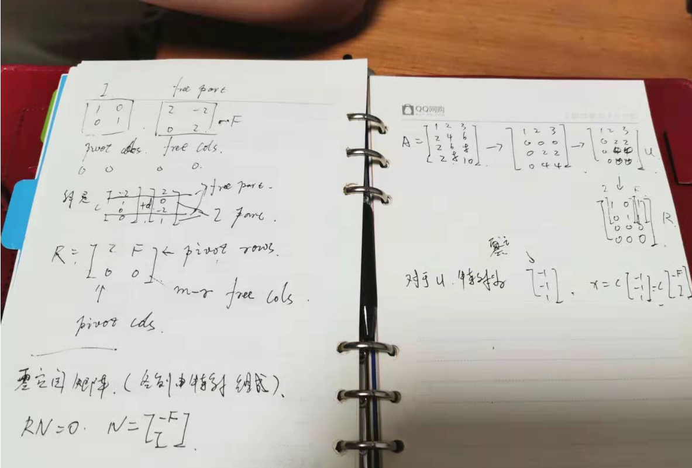

# 求 Ax = 0 的解空间

有矩阵如下, 先对其消元：
$$
A=\begin{bmatrix}1& 2 & 2 & 2 \\2& 4 & 6 & 8 \\3& 6 & 8 & 10 \\\end{bmatrix}
\Rightarrow
\begin{bmatrix}1& 2 & 2 & 2 \\0& 0 & 2 & 4 \\0& 0 &2 & 4 \\\end{bmatrix}
\Rightarrow
\begin{bmatrix}1& 2 & 2 & 2 \\0& 0 & 2 & 4 \\0& 0 &0 & 0 \\\end{bmatrix}=U
$$

!!! INFO
    这个矩阵$U$ 有两个主元， 矩阵主元的数量称为矩阵的**秩**。  
    主元所在的列称为**主列**(pivot column)， 其它列称为**自由列**(free column)

自由列对应的解是任意的， 如上列 $x_2, x_4$, 称为**自由变量**。可以找任意值代入方程，如：$x=[x_1,1,x_3, 0]^T$， 则可解出$x=[-2,1,0,0]^T$， 可得出$x$ 的一个子空间为 $x=c[-2,1,0,0]^T$   
上例构成一个子空间， 但不是所有子空间， 另一个例子为 $x=d\begin{bmatrix}2 \\ 0 \\ -2 \\ 1\end{bmatrix}$， 通过两个特解的组合可以得到整个子空间
$$
x=c \begin{bmatrix}-2 \\ 1 \\ 0 \\ 0 \end{bmatrix} 
+d\begin{bmatrix}2 \\ 0 \\ -2 \\ 1 \end{bmatrix} 
$$
有多少个特解等于自由变量的个数 。

从上例可以得到求解的步骤：
1. 消元
2. 找出秩
3. 找出特解

## 简化行阶梯矩阵

上面的消元矩阵$U$ 可继续简化

$$
\begin{bmatrix}1& 2 & 2 & 2 \\0& 0 & 2 & 4 \\0& 0 &0 & 0 \\\end{bmatrix}
\stackrel{向上消元（主元上下都为0）}{\Longrightarrow}
\begin{bmatrix}1& 2 & 0 & -2 \\0& 0 & 2 & 4 \\0& 0 &0 & 0 \\\end{bmatrix}
\stackrel{使主元都为1}{\Longrightarrow}
\begin{bmatrix}1& 2 & 0 & -2 \\0& 0 & 1 & 2 \\0& 0 &0 & 0 \\\end{bmatrix} = R
$$

!!!
    把$R$ 中的主行及主列抽出来将得到单位矩阵 $I$

把 $R$ 写成以下形式：

