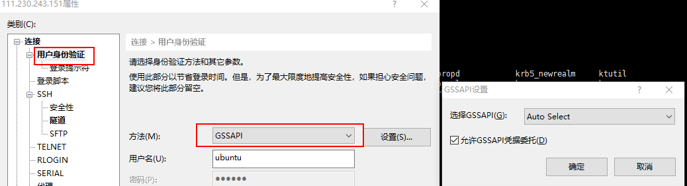

# SSH with Kerbors5 on Ubuntu

## kerberos server and admin server install

```bash
sudo apt install krb5-kdc krb5-admin-server
```

key config in /etc/krb5.conf
```conf
[libdefaults]
	default_realm = EXAMPLE.COM
[realms]
	EXAMPLE.COM = {
		kdc = kdc.example.com
		admin_server = kbr-admin.example.com
	}
```

```bash
#init realm
# may be take long time to wait after the notice `Loading random data`
krb5_newrealm
```

添加用户
```bash
kadmin.local
addprinc username
```

```bash
# 给机器 s1 添加 Princple 及 keytab ， 并将该 keytab 复制到 s1 机器 /etc 目录下， sshd 会用到 krb5.keytab, 确定主机名一致
kadmin.local -q "addprinc -randkey host/s1.dev.example.com"
kadmin.local -q " ktadd -k /etc/krb5.keytab host/s1.dev.example.com"

```

## ssh server 


保证跟 kdc 一样的 krb5.conf
```conf
[libdefaults]
	default_realm = EXAMPLE.COM
[realms]
	EXAMPLE.COM = {
		kdc = kdc.example.com
		admin_server = kbr-admin.example.com
	}
```

修改 /etc/ssh/sshd_config
```
KerberosAuthentication yes
KerberosTicketCleanup yes
GSSAPIAuthentication yes
GSSAPICleanupCredentials yes
```

在 $HOME/.k5login 中列出允许登录的 princ 
```
user1@EXAMPLE.COM
```


## ssh client

install kerberos client
```bash
apt install krb5-user

# 初始化 ticket
kinit user

```


## xshell 通过 kerberos 登录 

安装 MIT Kerberos for Windows 4.1 

* 64-bit MSI Installer [kfw-4.1-amd64.msi](http://web.mit.edu/kerberos/dist/kfw/4.1/kfw-4.1-amd64.msi), 10812k.
* 32-bit MSI Installer [kfw-4.1-i386.msi](http://web.mit.edu/kerberos/dist/kfw/4.1/kfw-4.1-i386.msi), 5836k.

使用上面的  krb5.conf 覆盖到  `C:\ProgramData\MIT\Kerberos5\krb5.ini`, 或通过 `KRB5_CONFIG` 环境变量指定 `krb5.ini` 位置



## 参考文章


https://help.ubuntu.com/lts/serverguide/kerberos.html.en#kerberos-server
http://www.visolve.com/ssh.php#Kerberos_Authentication
https://docs.oracle.com/cd/E19253-01/819-7061/6n91j2vds/index.html