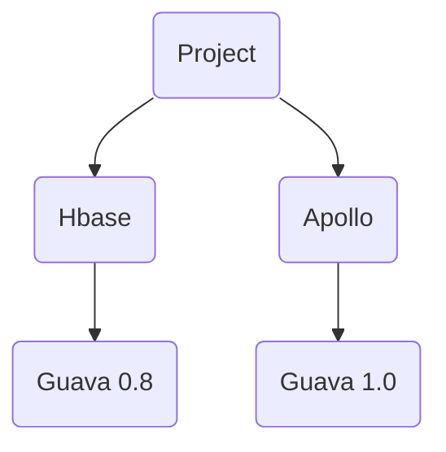

---
tags:
    - maven
---

# 依赖冲突



如上图所示， project 项目依赖了 HBase 与 Apollo , 而这两个类库同时依赖了 guava， 但不是同一个版本。 Maven 的版本仲裁机制能保证最后只有一个 guava 版本进入到依赖树中。 但这两个版本刚好不兼容， 不管选用哪个版本， 程序都不能正常运行。

Java 9 的模块化应该解决了这个问题， 使用Java 8 的项目需要给依赖库重新打包， 比如把 guava 0.8 中的类换个包名跟 HBASE 一起重新打个包， 这样 hbase 中用到的 guava 类跟 apollo 中用到的 guava 类包名不同， 就不会产生冲突了。

以上操作如果手工执行的话非常麻烦， 需要修改 hbase 的源码。 幸好有一个 Maven 插件 maven-share-plugin 可以做这个事情 。

```xml
<?xml version="1.0" encoding="UTF-8"?>
<project xmlns="http://maven.apache.org/POM/4.0.0"
         xmlns:xsi="http://www.w3.org/2001/XMLSchema-instance"
         xsi:schemaLocation="http://maven.apache.org/POM/4.0.0 http://maven.apache.org/xsd/maven-4.0.0.xsd">
    <modelVersion>4.0.0</modelVersion>

    <groupId>your.org</groupId>
    <artifactId>hbase-client-shared</artifactId>
    <version>1.2.0</version>

    <dependencies>
        <dependency>
            <groupId>org.apache.hbase</groupId>
            <artifactId>hbase-client</artifactId>
            <version>1.2.0</version>
        </dependency>
    </dependencies>

    <build>
        <plugins>
            <plugin>
                <groupId>org.apache.maven.plugins</groupId>
                <artifactId>maven-shade-plugin</artifactId>
                <version>2.4.1</version>
                <configuration>
                    <createDependencyReducedPom>false</createDependencyReducedPom>
                    <createSourcesJar>true</createSourcesJar>
                </configuration>
                <executions>
                    <execution>
                        <phase>package</phase>
                        <goals>
                            <goal>shade</goal>
                        </goals>
                        <configuration>
                            <artifactSet>
                                <excludes>
                                    <exclude>log4j:log4j</exclude>
                                    <exclude>org.slf4j:*</exclude>
                                    <exclude>junit:junit</exclude>
                                    <exclude>org.hamcrest:hamcrest-core</exclude>
                                </excludes>
                            </artifactSet>
                            <relocations>
                                <relocation>
                                    <pattern>com.google</pattern>
                                    <shadedPattern>hbase.shared.com.google</shadedPattern>
                                </relocation>
                            </relocations>
                            <transformers>
                                <transformer implementation="org.apache.maven.plugins.shade.resource.ManifestResourceTransformer" />
                            </transformers>
                        </configuration>
                    </execution>
                </executions>
            </plugin>
        </plugins>
    </build>
</project>
```